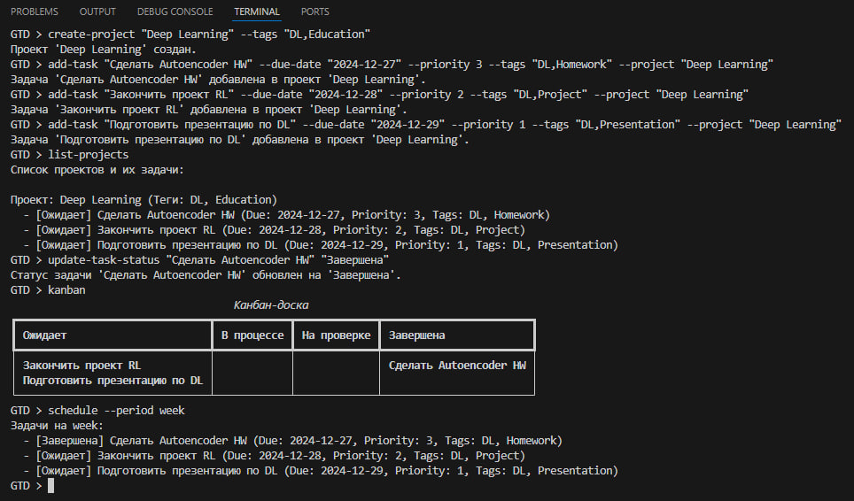
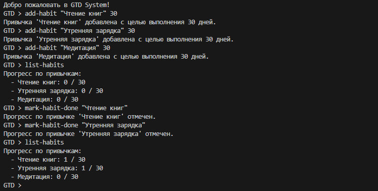

# GTD Task Management System

## Description
This is a task management system inspired by the Getting Things Done (GTD) methodology. It supports task management, project organization, habit tracking, and Kanban visualization.

## Features
- Add and manage tasks.
- Organize tasks into projects.
- View schedules for the day, week, or month.
- Track habits with progress visualization.
- Visualize tasks in a Kanban board.

## Structure
```bash
/gtd_project/
├── gtd/
│   ├── __init__.py
│   ├── base_item.py
│   ├── task.py
│   ├── project.py
│   ├── gtd_system.py
│   ├── kanban.py
│   ├── habit_tracker.py
│   ├── exceptions.py
├── tests/
│   ├── test_task.py
│   ├── test_project.py
│   ├── test_gtd_system.py
│   ├── test_habit_tracker.py
│   └── test_kanban.py
├── requirements.txt
├── README.md
├── cli.py
└── main.py
```

## Installation
```bash
pip install -r requirements.txt
```

## Usage
Run the CLI:
```bash
python cli.py
```

### Commands
Add a task:
  ```bash
  add-task "Task Title" --due-date "2024-12-25" --priority 3 --tags "Tag1,Tag2" --project "Project Name"
  ```
List all tasks:
  ```bash
  list-tasks
  ```
Add a habit:
  ```bash
  add-habit "Read a book" 30
  ```
Mark a habit as done:
  ```bash
  mark-habit-done "Read a book"
  ```
View Kanban board:
  ```bash
  kanban
  ```
Create a new project:
  ```bash
  create-project "Project Name" --tags "Tag1,Tag2"
  ```
Add a task to a project:
  ```bash
  add-task-to-project "Task Title" "Project Name"
  ```
Update task status:
  ```bash
  update-task-status "Task Title" "Status"
  ```
View all projects and tasks:
  ```bash
  list-projects
  ```
View schedule:
  ```bash
  schedule --period [day|week|month]
  ```
Remove a task:
  ```bash
  remove-task "Task Title"
  ```
Remove a project:
  ```bash
  remove-project "Project Name"
  ```
List all habits:
  ```bash
  list-habits
  ```
Delete a habit:
  ```bash
  delete-habit "Read a book"
  ```


## Example Scenario: Deep Learning Project Management



1. **Create a project:**
   ```bash
   create-project "Deep Learning" --tags "DL,Education"
   ```

2. **Add tasks to the project:**
   ```bash
   add-task "Complete Autoencoder HW" --due-date "2024-12-27" --priority 3 --tags "DL,Homework" --project "Deep Learning"
   add-task "Finish RL Project" --due-date "2024-12-28" --priority 2 --tags "DL,Project" --project "Deep Learning"
   add-task "Prepare DL Presentation" --due-date "2024-12-29" --priority 1 --tags "DL,Presentation" --project "Deep Learning"
   ```

3. **View all projects and tasks:**
   ```bash
   list-projects
   ```

4. **Update task status:**
   ```bash
   update-task-status "Complete Autoencoder HW" "Завершена"
   ```

5. **View Kanban board:**
   ```bash
   kanban
   ```

6. **Check schedule for the week:**
   ```bash
   schedule --period week
   ```

## Example Scenario: Habit Tracker Management



1. **Add habits:**
   ```bash
   add-habit "Чтение книг" 30
   add-habit "Утренняя зарядка" 30
   add-habit "Медитация" 30
   ```

2. **List habits:**
   ```bash
   list-habits
   ```

3. **Mark habits as done:**
   ```bash
   mark-habit-done "Чтение книг"
   mark-habit-done "Утренняя зарядка"
   ```

4. **List habits again:**
   ```bash
   list-habits
   ```
